# Photo Cleaner AI

## Table of contents

- [How to Use](#how-to-use)
- [Code Conventions](#code-conventions)
- [Git Conventions](#git-conventions)
- [dependencies](#dependencies)

## Prerequisites

- Flutter 3.38.7
- Android Studio - [latest version](https://developer.android.com/studio/install?gclid=Cj0KCQjwiIOmBhDjARIsAP6YhSWAACh94FR8rU7TUR5My3O9zfbvsdcwq3MuupLn6QDGX5KUDQAv_l0aAjg1EALw_wcB&gclsrc=aw.ds)
- VS Code - [last version](https://code.visualstudio.com/download)
- MacOS & XCode (for build & debug iOS)

## Link

- [Comana](https://goldenowl.comana.vn/manager/chores/projects/0955afbf-23ff-4028-b9b6-4810e69b865f?locale=en)
- [Tasks - Trello](https://trello.com/b/Yjc1MvHW/snaplife)

## How to Use

- **Step 1:** Download or clone this repo by using the link below:

  ```sh
    https://github.com/luke-nguyen-goldenowl/Photo-Cleaner-AI.git
  ```

- **Step 2:** Install Flutter

  - Install the platform-specific SDK — see the [Flutter installation guide](https://flutter.dev/docs/get-started/install)

- **Step 3:** Setup flutter and run locally

  - Go to project root and execute the following command in console to get the required dependencies:

    ```sh
    flutter pub get
    ```

  - Connect your physical device or open simulator. then run your app

    ```sh
    flutter run
    ```

- **Step 4:**
  This project uses inject library that works with code generation, execute the following command to generate files (re-run every time you change one of these files)

  - Firstly, if you have not installed flutter_gen yet, see the flutter_gen installation guide: [flutter_gen installation](https://pub.dev/packages/flutter_gen#installation)
  - Secondly, generate files for packages that use build_runner (auto_route, freezed...)

    ```sh
    flutter pub run build_runner build --delete-conflicting-outputs
    ```

- **Step 5:** Download the .env file from [here](https://drive.google.com/file/d/1Mzsu3cW70RcPx6veB0b_cMR9tJJ5RXEp/view?usp=sharing) and place it in the root directory following the structure below:

  ```sh
    ├── lib/
    ├── resources/
    ├── test/
    ├── web/
    │
    ├── .env/
  ```

  ### Android

  1. Change version and build number in `pubspec.yaml`

     ```sh
     flutter build appbundle
     ```

  2. Or run command line below to build with your build version

     ```sh
     flutter build appbundle --build-name=1.2.0 --build-number=2
     ```

  3. Access [Play console](https://play.google.com/console/u/0/developers) to create a new release and upload your build

  ### iOS

  1. Change version and build number in Xcode
  2. Access <https://developer.apple.com/> to download profile and signing your app

  - **Manually:** Pod install then Open Xcode to deploy

    ```sh
    flutter build ios --release --no-codesign
    cd ios && pod install
    ```

    - Open XCode and deploy
    - On menu bar, select **Product** > **Archive** to build and deploy to TestFlight

  - **Use Fastlane:** run command bellow

    ```sh
    cd ios
    fastlane beta
    ```

## Code Conventions

- [analysis_options.yaml](analysis_options.yaml)
- [About code analytics flutter](https://medium.com/flutter-community/effective-code-in-your-flutter-app-from-the-beginning-e597444e1273)

  In Flutter, Modularization will be done at a file level. While building widgets, we have to make sure they stay independent and re-usable as maximum. Ideally, widgets should be easily extractable into an independent project.

- Must know
  - Model name start with `M`: MUser, MProduct, MGroup...
  - Common widget start with `X`: XButton, XText, XAppbar... - These widgets under folder `lib/widgets/`
  - App Constants class or service start with `Add`: AppStyles, AppColor, AppRouter, AppCoordinator,.. and UserPrefs

## Git Conventions

- [Git Versioning and Code Reviews](https://www.notion.so/jimmy9/Git-Versioning-and-Code-Reviews-dea414c5e38d4db7b36180e395843968)
- [Gitflow workflow](https://jimmy9.notion.site/Gitflow-workflow-414b8914b7e64a4d8198d47e6d9cc2f8?pvs=4)

## Architecture diagram

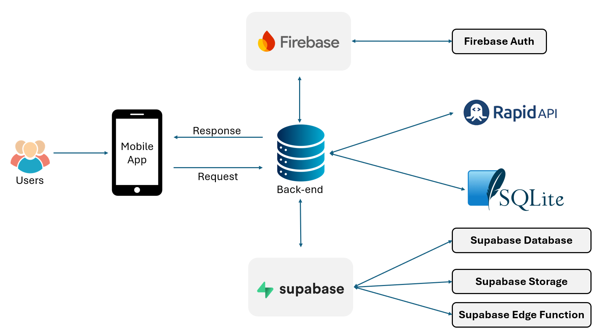

## Database diagram

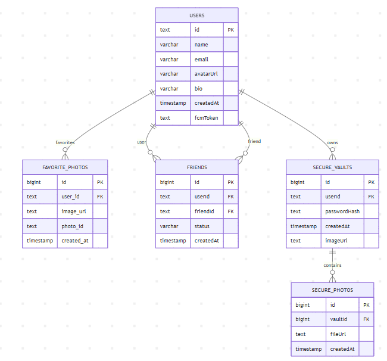

## Dependencies

- [flutter_bloc](https://pub.dev/packages/flutter_bloc) A dart package that helps implement the BLoC pattern. Learn more at [bloclibrary.dev](https://bloclibrary.dev/#/)!

- [go_route](https://pub.dev/packages/go_route) It’s a Flutter navigation package

- [flutter_gen](https://pub.dev/packages/flutter_gen) The Flutter code generator for your assets, fonts, colors, … — Get rid of all String-based APIs.

- [supabase_flutter](https://pub.dev/packages/supabase_flutter) Official Flutter SDK for Supabase, providing authentication, PostgreSQL database access, storage, and real-time subscriptions.

- [flutter_image_compress](https://pub.dev/packages/flutter_image_compress) A Flutter plugin for compressing images with support for resizing, rotating, and quality adjustment.

- [image_picker](https://pub.dev/packages/image_picker) A Flutter plugin that allows users to select images and videos from the device gallery or camera.

- [photo_manager](https://pub.dev/packages/photo_manager) A Flutter plugin for managing photos and videos on the device with album access and permission handling.

- [redacted](https://pub.dev/packages/redacted) A Flutter package for creating skeleton loading and redacted placeholder UI components.

- [sqflite](https://pub.dev/packages/sqflite) A Flutter plugin that provides SQLite database support for persistent local storage.

- [path_provider](https://pub.dev/packages/path_provider) A Flutter plugin for accessing commonly used filesystem locations such as temporary and application directories.

- [internet_connection_checker_plus](https://pub.dev/packages/internet_connection_checker_plus) A Flutter utility package for checking and monitoring internet connectivity status.

- [exif](https://pub.dev/packages/exif) A Dart library for reading EXIF metadata from image files, including GPS and camera information.

- [flutter_map](https://pub.dev/packages/flutter_map) A customizable Flutter map widget based on Leaflet, supporting multiple map providers.

- [latlong2](https://pub.dev/packages/latlong2) A Dart library for performing geographic calculations using latitude and longitude.

- [syncfusion_flutter_datepicker](https://pub.dev/packages/syncfusion_flutter_datepicker) A feature-rich Flutter date picker supporting single date, range, and multi-date selection.

- [http](https://pub.dev/packages/http) A Dart package for making HTTP requests with a simple and composable API.

- [media_store_plus](https://pub.dev/packages/media_store_plus) A Flutter plugin for interacting with Android MediaStore to save and manage media files.

- [file_picker](https://pub.dev/packages/file_picker) A Flutter plugin that allows users to pick files from the device storage.

- [video_player](https://pub.dev/packages/video_player) A Flutter plugin for playing videos from assets, network, or local files.

- [chewie](https://pub.dev/packages/chewie) A higher-level Flutter video player built on top of video_player with customizable controls.

- [flutter_map_marker_cluster](https://pub.dev/packages/flutter_map_marker_cluster) A Flutter Map plugin that provides marker clustering for improved map performance and usability.

- [tflite_flutter](https://pub.dev/packages/tflite_flutter) A Flutter plugin for running TensorFlow Lite models efficiently on mobile devices.

- [image](https://pub.dev/packages/image) A pure Dart library for image decoding, encoding, and pixel-level manipulation.

- [timeago](https://pub.dev/packages/timeago) A Dart library for formatting DateTime values into human-readable relative time strings.

- [diacritic](https://pub.dev/packages/diacritic) A Dart utility for removing diacritical marks from strings, useful for search normalization.

- [flutter_file_downloader](https://pub.dev/packages/flutter_file_downloader) A Flutter plugin for downloading files with background support and progress tracking.

- [local_auth](https://pub.dev/packages/local_auth) A Flutter plugin for biometric authentication using fingerprint, face recognition, or device credentials.

- [app_settings](https://pub.dev/packages/app_settings) A Flutter plugin that allows opening system settings such as app permissions, Wi-Fi, and location.

## Screenshot

<div style="display: flex; flex-direction: column; gap: 28px;">

<div>
  <h3>Onboarding</h3>
  <div style="display: flex; flex-wrap: wrap; gap: 12px;">
    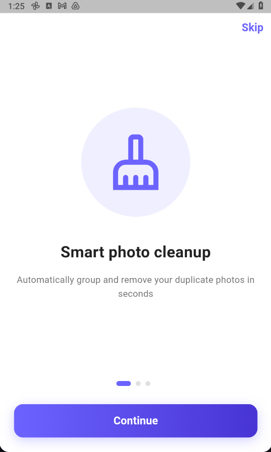
    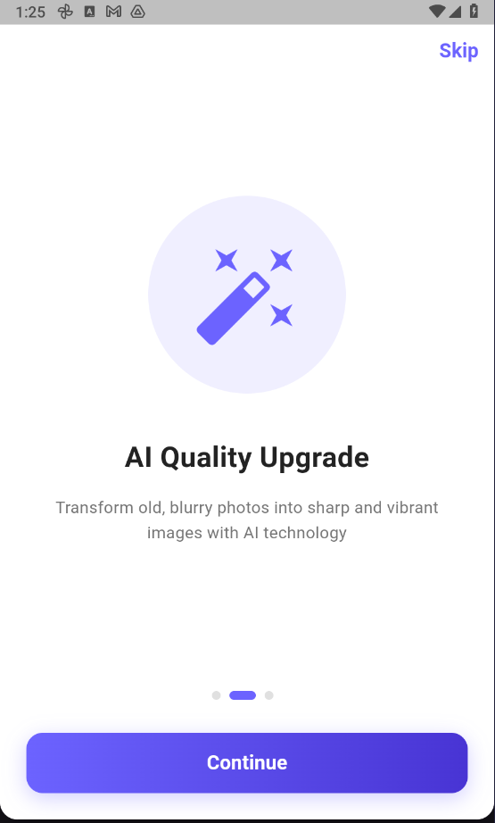
    
    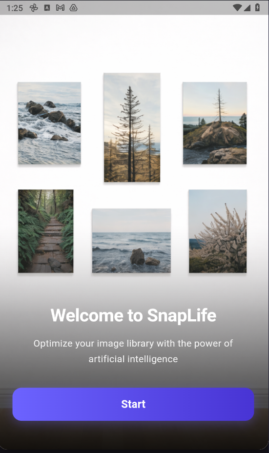
  </div>
</div>

<div>
  <h4>Authentication</h4>
  <div style="display: flex; flex-wrap: wrap; gap: 12px;">
    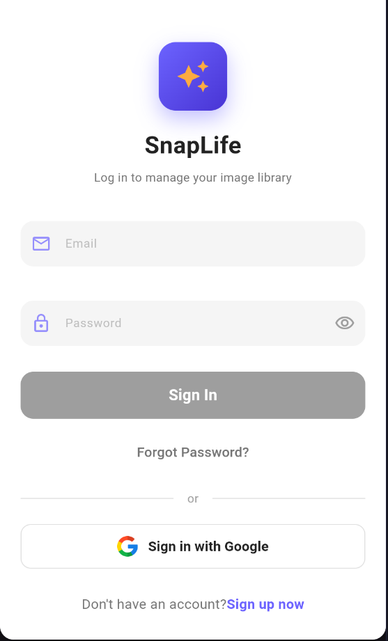
    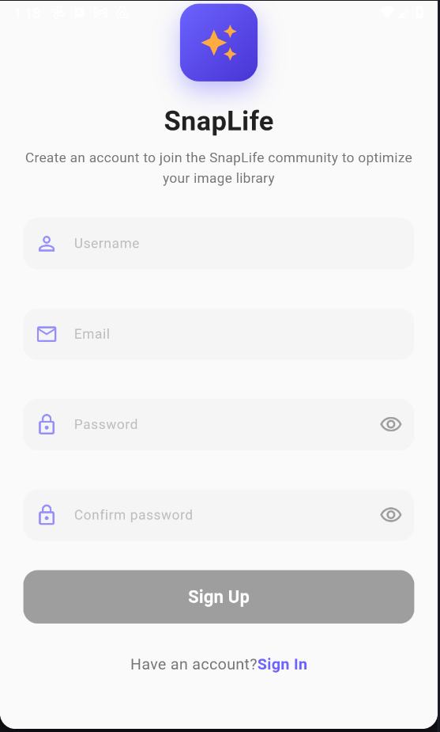
    
    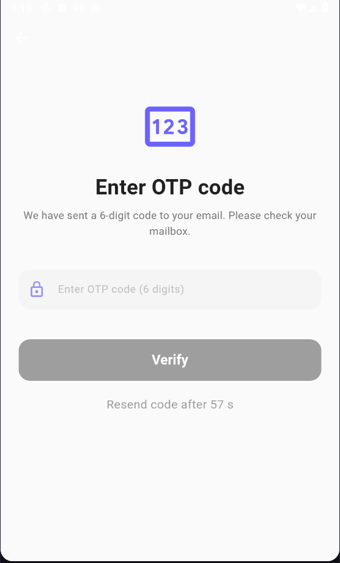
    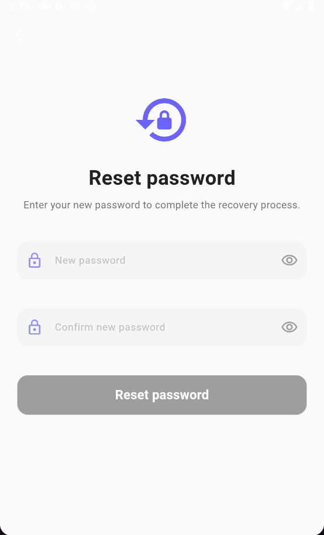
  </div>
</div>

<div>
  <h4>Main Tab</h4>
  <div style="display: flex; flex-wrap: wrap; gap: 12px;">
    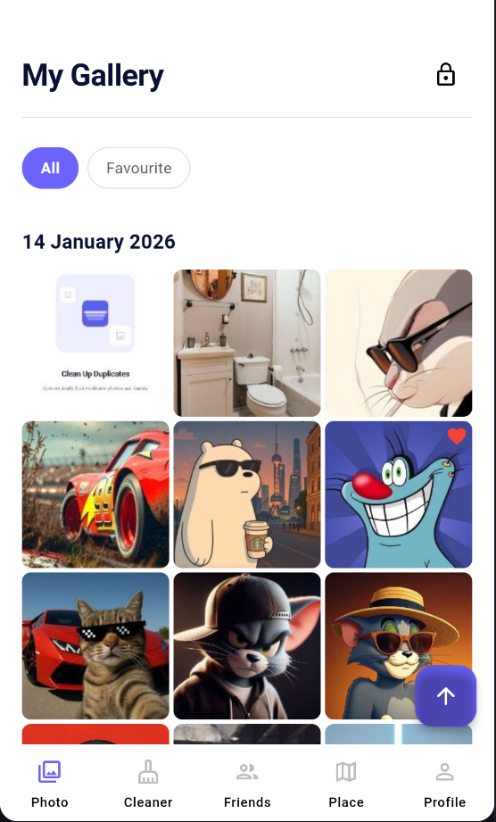
    
    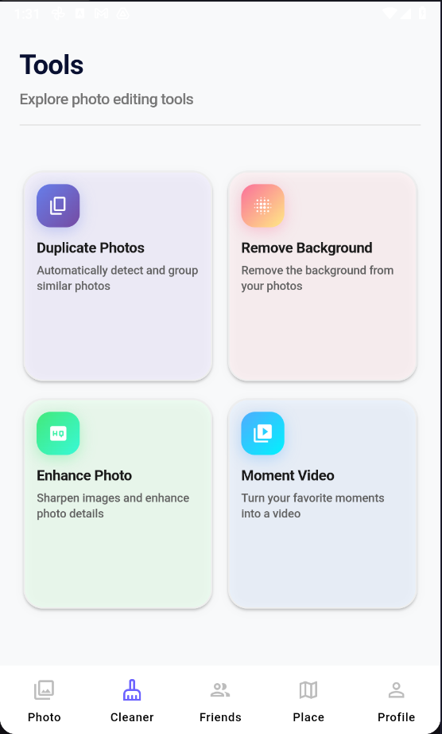
    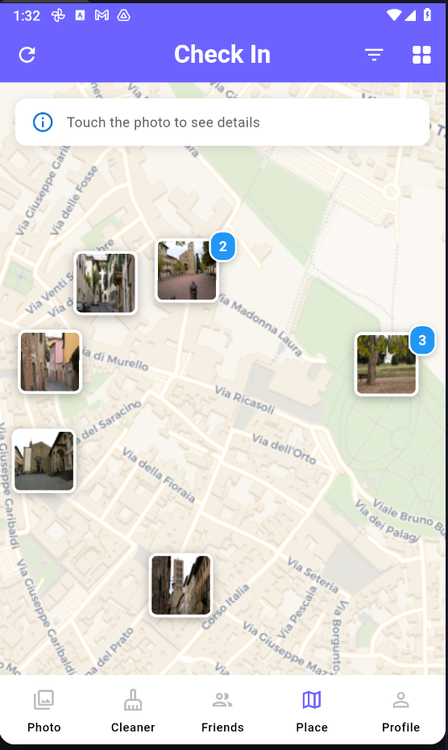
    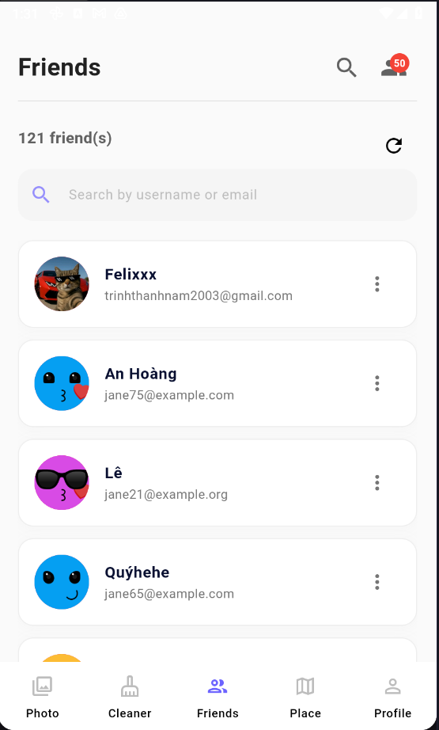
    
  </div>
</div>
</div>
